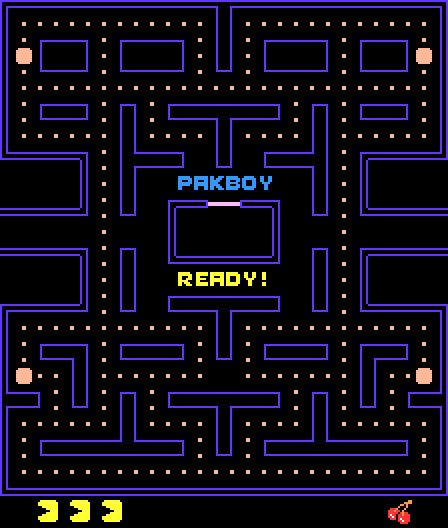

# PakBoy

PacMan demake for [RIVES](https://rives.io).



You can play in your browser at its
[emulator page](https://emulator.rives.io/#cartridge=https://raw.githubusercontent.com/edubart/cartridges/main/pakboy.sqfs).
Code originally based on https://github.com/floooh/pacman.zig.

## Build and Run

Make sure you have [Zig](https://ziglang.org/) and [RIV SDK](https://rives.io/docs/category/riv) installed first, then:

```bash
make
rivemu pakboy.sqfs
```

## Notes

The original pacman.zig project used original PacMan ROM assets,
which were all removed.

The color palette, graphics and sounds were all replaced by some
assets crafted with GIMP, while the game logic was untouched.
The sound waveforms were all replaced to use RIV standard waveforms.
Overall the colors, sprites and sounds are all different.

## Zig usage

I originally went through this project to learn more about Zig,
turns out using Zig to make games for RIV emulator is straightforward.
We can even cross compile which makes compiling very fast.
All the C API is easy to use through `@cImport` Zig statement.
To compile just need to copy `riv.h` and `libriv.so` from RIV SDK to the local directory,
which the `Makefile` does automatically.
Search for `riv` in `pakman.zig` to grasp how it looks like to use the RIV APIs with Zig.

